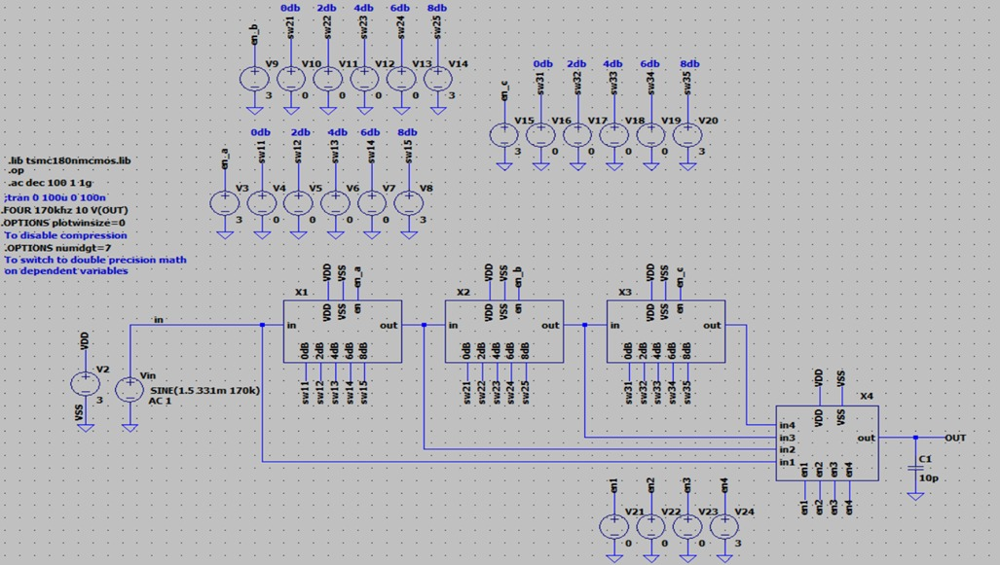

University: Technical University of Cluj-Napoca  
Course: High-frequency analog circuits  
Author: Daniil Zabunov  
Year: 2024      

# Project Overview: Analog Filter Design with Gm-C and Tow-Thomas Topology

This project focuses on designing an analog filter that processes electrical signals by selectively allowing certain frequencies to pass while blocking others. The filter is built using advanced techniques to ensure precision and efficiency, suitable for applications like audio processing, communication systems, and signal conditioning.

## Key Features
- **Filter Type:** Gm-C, Tow-Thomas topology
- **Passband Frequency:** 0.85 MHz
- **Filter Approximation:** Butterworth, chosen for its flat frequency response in the passband
- **Current Consumption:** Less than 2 mA, making it energy efficient
- **Power Supply Voltage (Vdd):** 3V, compatible with low-power applications

## Tools Used
The following tools were employed for the design, simulation, and analysis of the filter:
- **LTspice:** Used for circuit simulation to validate the design and ensure the filter meets its performance specifications.
- **CAD Techniques:** For schematic capture and design layout.
- **Mathematical Analysis:** To derive and fine-tune the filter's parameters for optimal performance.

## Design Details

### 1. Filter Specifications
The filter is designed to have a smooth frequency response, meaning it processes the signal without introducing sharp changes or distortions. The Butterworth approximation is selected for its balance between performance and simplicity.

- **Passband:** The range of frequencies allowed through is centered around 0.85 MHz.
- **Frequency Response:** At the -3 dB point, the filter's output power is half of its maximum, marking the edge of its passband.

### 2. Gm-C Integrator Design
The Gm-C integrator is a critical component that helps shape the frequency response of the filter.

- **Current Control:** The circuit uses a current-controlled transconductance amplifier, where the output current is proportional to the input voltage, allowing precise control of the filter’s behavior.
- **Passive Elements:** These include resistors and capacitors, which are carefully sized to ensure the filter meets its frequency specifications.

### 3. Tow-Thomas Biquad Design
This topology is a building block of the filter, combining integrators and amplifiers to achieve the desired frequency response.

- **Stability and Precision:** The Tow-Thomas design helps maintain stability across the entire operating range, providing consistent performance.

### 4. Active Cell Implementation
Active components like transistors are used to amplify the signal and maintain the desired frequency response.

- **Kwan-Martin Gm Cell:** A specific implementation that offers high linearity and low power consumption.
- **Key Parameters:** 
  - Transconductance (\( Gm \)) set to 100 µS
  - High output resistance (\( R_{out} \)) to ensure minimal signal loss

### 5. Programmable Gain Amplifier (PGA)
The PGA allows dynamic adjustment of the signal amplification, essential for handling different signal levels.

- **Gain Range:** From 0 dB to 24 dB in 2 dB steps, providing flexibility in signal processing.
- **Operational Range:** Handles signals across a wide bandwidth, making it suitable for various applications.

### 6. Operational Amplifier (OA) Design
Operational amplifiers are used to boost the signal strength while maintaining accuracy.

- **Cascoded-Pliated Design:** Enhances the amplifier’s performance by improving its gain and bandwidth.
- **Performance Metrics:**
  - Slew Rate: The speed at which the output can change, ensuring quick response to input changes.
  - Gain Bandwidth Product: Measures the amplifier’s ability to maintain gain over a wide frequency range.

## Simulation Results
Simulations are conducted to validate the design, ensuring the filter meets its specifications.

- **Frequency Response:** Verified to ensure the filter operates within the desired range.
- **Gain and Bandwidth:** Confirmed through simulations, showing the filter maintains its performance across the specified frequency range.
- **THD (Total Harmonic Distortion):** Evaluated to ensure signal integrity, with room for further optimization.

## Conclusion
This project demonstrates a robust analog filter design combining advanced techniques like Gm-C integrators and Tow-Thomas topology. The result is a highly efficient, precise filter suitable for a range of applications, from audio processing to communication systems.

## Applications
- **Audio Equipment:** Enhances sound quality by filtering out noise and unwanted frequencies.
- **Communication Devices:** Improves clarity by isolating desired signal frequencies.
- **Medical Devices:** Ensures accurate signal processing in diagnostic equipment.

